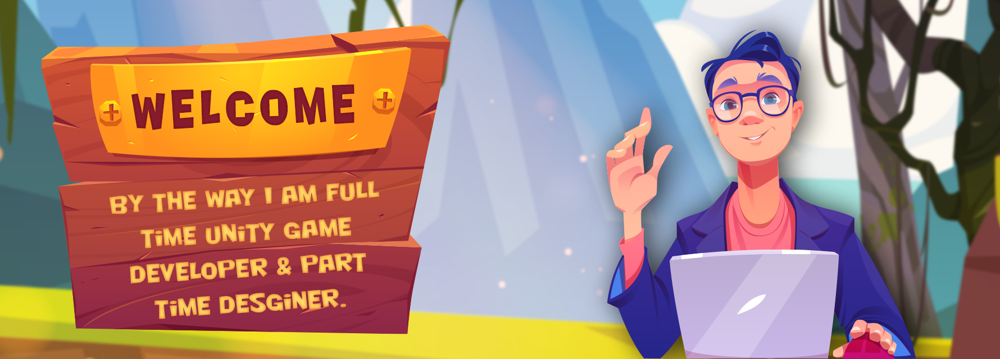

<!-- in your header -->
<link rel="stylesheet" href="https://cdn.jsdelivr.net/gh/devicons/devicon@latest/devicon.min.css">

### Hi there, I'm Sufwan Saleem - [sufwanDev][website] 👋

<!-- [][website] -->

## :joystick: I'm a Game Developer!!

- :muscle: Working on side project to Improve
- :brain: Trying to learn Shader Programming & Games Math
- :fist_right: 2021 Goals: Complete the Game Dev Maths
- :paintbrush: Fun fact: I love to do art
- :clinking_glasses: Looking forward to meet like minded people

### :handshake:	 Connect with me:

Don't be hesitent to connect. I promise I wont bite :smile:

[][gmail]
[][whatsapp]
[][linkedin]

<!-- [][website] -->

 

### Languages and Tools:

 

### Follow me on Github Thanks :smile: Have a nice Day!

<!-- 

  
:zap: Recent GitHub Activity

  
<!--START_SECTION:activity-->
<!-- 1. 🗣 Commented on [#2](https://github.com/codeSTACKr/portfolio-sass/issues/2) in [codeSTACKr/portfolio-sass](https://github.com/codeSTACKr/portfolio-sass) -->
<!--END_SECTION:activity-->

<!-- 
 -->

<!-- MAJOR LINKS -->
[website]: https://google.com
[gmail]: mailto:muhammadsufwan33072@gmail.com
[whatsapp]: https://wa.me/+923034001771
[linkedin]: https://www.linkedin.com/in/sufwan-s-362b27198
[linktree]: https://linktr.ee/muhammadsufwan

<!-- MARKDOWN GUIDE : https://guides.github.com/features/mastering-markdown/ -->
